# Relatorio de atividade avaliativa - Sistemas Operacionais

Aluna: Marcia Souza Mendonça\
Data: 19.09.2025

## Introdução

Relatório da primeira atividade avaliativa da disciplina de Sistemas Operacionais do curso técnologo de Análise e Desenvolvimento de Sistemas. A atividade visa a prática de comandos básicos do Linux em um contêiner Docker baseado no Fedora. A estrutura contempla print do passo a passo com descrição de atividades, seguida de __relato de aprendizados e dificuldades__.Trata-se também de um relatório para documentação de progresso e minha consulta posteriormente.

## Relato

### 📌 2.2.1. Iniciar um contêiner Fedora

Download e execução do contêiner Fedora:

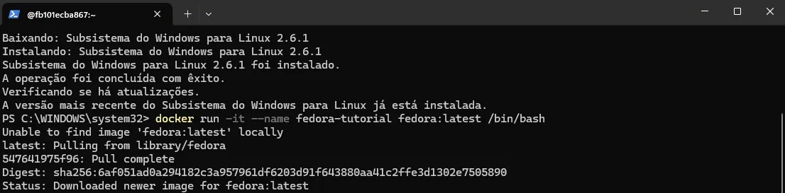

### 📌 2.2.2. Navegação básica

Navegação básica para se familiarizar com os comandos de navegação:

Passo 1. Verificação de em qual diretório estou:

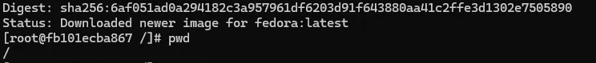

O "/" me aponta que estou no diretório raiz

Passo 2. Acesso ao diretório home do usuário:

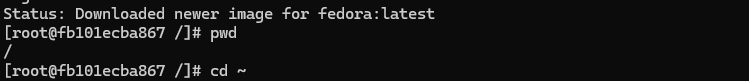

Observe que o prompt do terminal altera de [... /] para [...~].

Passo  3. Listagem dos arquivos e pastas do diretório atual:\

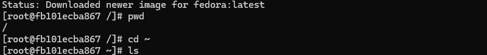

Após o comando ls nada aparece pois a pasta está vazia.

Passo  4. Criação de uma pasta chamada atividades:

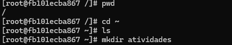

Passo  5. Entrando na pasta atividades criada anteriormente:

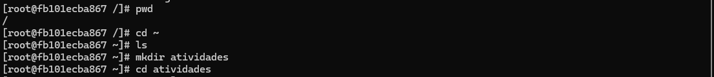

Passo 6. Voltando para o diretório anterior:

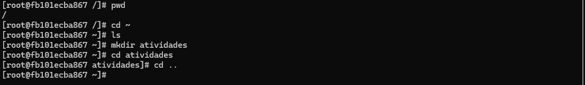

Observe que o prompt do terminal altera de [... atividades] para [...~].

###  📌 2.2.3. Manipulação de arquivos

Passo 1. Acessando o diretório home do usuário e verificando se o acesso foi feito:

O comando pwd confirmou que estou na pasta inicial do usuário root, administrador principal do sistema.

Passo 2. Criação de um arquivo arquivo1.txt no diretório home:

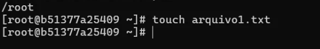

A falta de retorno visual no terminal indica que a operação foi concluída com sucesso. 

Passo 3. Renomação do arquivo para documento.txt:

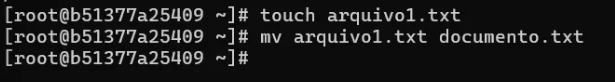

A falta de retorno visual no terminal indica que a operação foi concluída com sucesso. 

Passo 4. Acessando a pasta atividades (criada na Atividade 1):

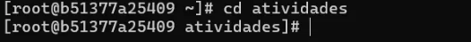

A falta de retorno visual no terminal indica que a operação foi concluída com sucesso. 

Passo 5. Criação de um subdiretório chamado backup dentro da pasta atividades:

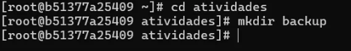

Como mostra a linha da criação da subpasta, o acesso a pasta atividades foi devidamente realizado pois o prompt do terminal finaliza com  [... atividades].

Passo 6. Copiando documento.txt (da home) para a subpasta backup:

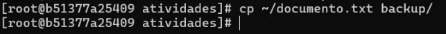

Já estando na pasta atividades, conforme mostra  [... atividades], utiliza-se o comando cp associado de ~, que significa o diretório "home" do usuário atual no terminal Linux.

- Verificação da cópia do arquivo para o backup

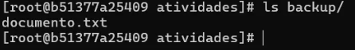

Passo 7. Voltando ao diretório home usando cd ~

- Verificação do local atual

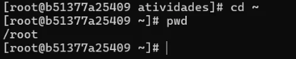

/root comunica que estamos no local esperado.

Passo 8. Exclusão do documento.txt original da home:

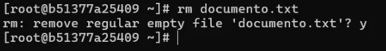

O comando rm solicita uma confirmação do usuário antes de remover um arquivo.

Passo 9. Verficando se o arquivo ainda existe em backup

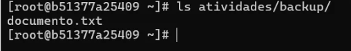

Para isso, foi preciso utilizar "ls" associado a todo o caminho de nosso interesse: ls atividades/backup/

### 📌 2.2.4. Gerenciamento de pacotes

Passo 1. Atualização da lista de pacotes:

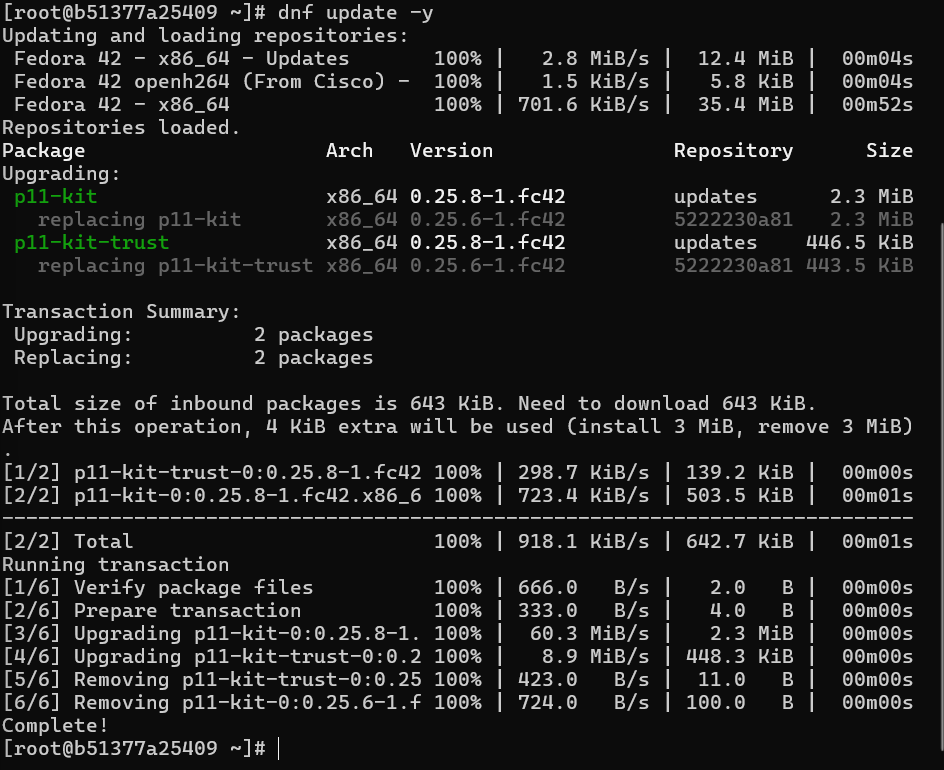

Passo 2. Instalação do editor de texto nano:

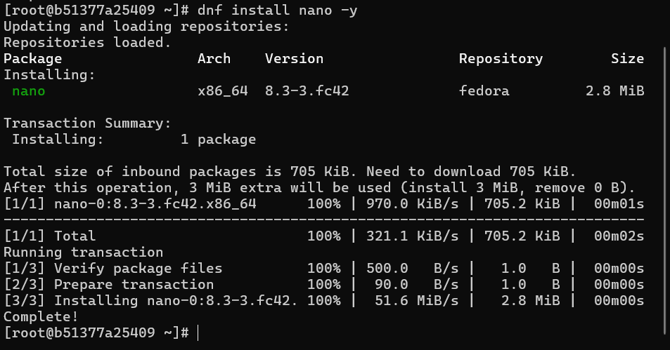

Passo 3. Verificando se o nano foi instalado:

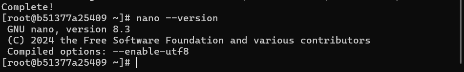

Passo 4. Remoção do nano:

### 📌 2.2.5. Permissões de arquivos

Objetivo: Modificar permissões de arquivos.

Passo 1. Criação de um arquivo script.sh:

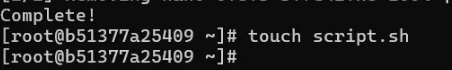

Passo 2. Dando permissão de execução ao dono:

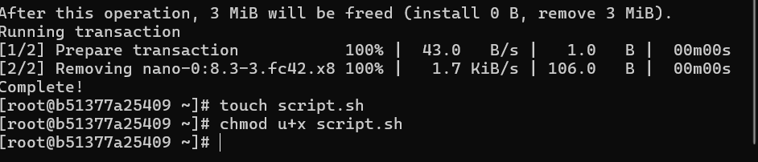

Passo 3. Verificação das permissões:

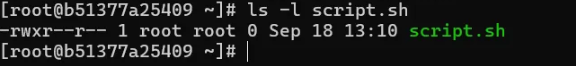

### 📌 2.2.6. Processos em execução

Objetivo: Monitorar e encerrar processos.

Passo 1. Listando processos em execução:

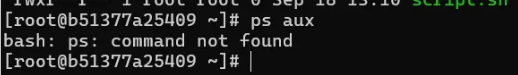

Como é possível observar pelo retorno no print acima, o comando não foi encontrado (ps: command nout found). Para executar o processo de número 3 (encontrar o PID do processo sleep), foi necessário baixar o pacote __procps-ng__, conforme mostrado abaixo:

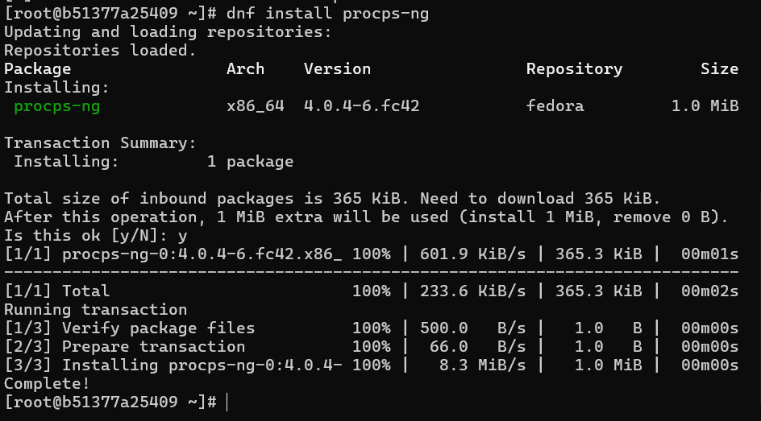

Comando __ps aux__ após instalação do pacote  __procps-ng__:

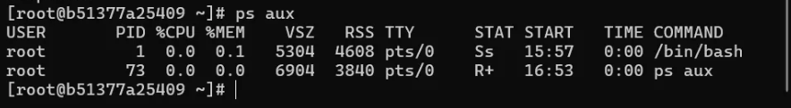

Este comando exibe os processos em execução no sistema. Podemos notar que há dois processos em execução: um shell /bin/bash e o próprio comando ps aux. 

USER: o usuário que está executando o processo.
PID: o número de identificação do processo.
%CPU: o uso de CPU.
%MEM: o uso de memória.
COMMAND: o comando que iniciou o processo. 

Passo 2. Execução de um processo em segundo plano (ex: sleep 60):

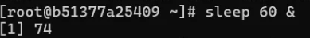

O "sleep 60" inicia um processo que fica "dormindo" por 60 segundos, ou seja, não utiliza o processador ativando, ficando em estado de espera. o __&__ é o elemento responsável por iniciar este processo __em segundo plano__, o que torna possível enviarmos um novo comando logo após (passo 3). O retorno dado pelo terminal, __1 [74]__ devolve o número da tarefa (1) e o PID do processo sleep (74).

Passo 3. Encontrando o PID do processo sleep:

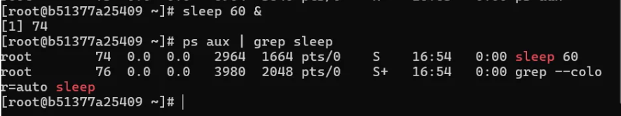

"ps aux | grep sleep" encontra o PID após uma busca por todos os processos que estão rodando, filtrando o que queremos pela palavra "sleep". Ao final, mostra os detalhes do processo. 

Passo 4. Encerrando o processo:

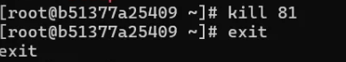

Como é possível observar acima, constam números diferentes na tarefa e PID do processo encerrado (4[81]). Isso se deu devido a algumas dificuldades no manejo da sintaxe do comando kill, conforme mostrado abaixo: 

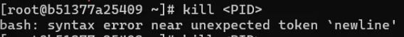

No processo de tentar entender o que estava ocorrendo, iniciei outro processo [2] 77:

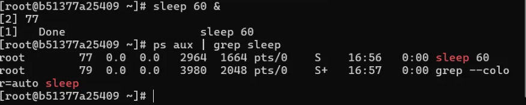

Enquanto isso, o processo de PID 60 foi concluído, pois o tempo se esgotou.

Foi feita uma nova tentativa, novamente com erro de sintaxe:

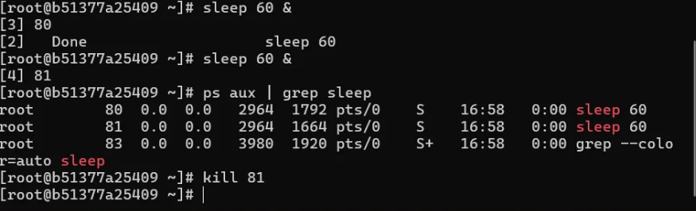

Após algumas tentativas, entre elas a criação de novos processos, compreendi o que estava ocorrendo e acertei a sintaxe do comando kill (kill PID, apenas).

### 📌 2.2.7. Encerrando o contêiner

Passo 1. Saída do container:

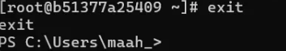

Passo 2. Remoção do container após o uso: 

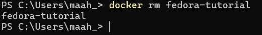

### Conclusão

O exercício foi meu primeiro contato com Docker, e pude fixar os comandos básicos com a ajuda do relatório. Os conceitos de Imagem e Container foram novos para mim e demoraram a fazer sentido. Superado esse ponto, a atividade ficou mais fácil.

Tive dificuldades de sintaxe na parte de execução (2.2.6) e precisei contornar problemas com o download de pacotes que não estavam nas instruções. Acredito que essas dificuldades me ajudaram a fixar o conteúdo.

Executei a tarefa em paralelo com pesquisas, já que alguns termos não são intuitivos. Por isso, acredito que o relatório será útil para futuras consultas.

