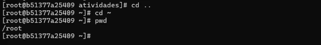

# Relatorio de atividade avaliativa - Sistemas Operacionais

Aluna: Marcia Souza Mendonça\
Data: 19.09.2025

## Introdução

Relatório da primeira atividade avaliativa da disciplina de Sistemas Operacionais do curso técnologo de Análise e Desenvolvimento de Sistemas. A atividade visa a prática de comandos básicos do Linux em um contêiner Docker baseado no Fedora. A estrutura contempla print do passo a passo com descrição de atividades, seguida de relato de aprendizados e dificuldades.

## Relato

### 📌 2.2.1. Iniciar um contêiner Fedora

Download e execução do contêiner Fedora:

### 📌 2.2.2. Navegação básica

Navegação básica para se familiarizar com os comandos de navegação:

1. Verificação de em qual diretório estou:

O "/" me aponta que estou no diretório raiz

2. Acesso ao diretório home do usuário:

Observe que o prompt do terminal altera de [... /] para [...~].

3. Listagem dos arquivos e pastas do diretório atual:\

Após o comando ls nada aparece pois a pasta está vazia.

4. Criação de uma pasta chamada atividades:

5. Entrando na pasta atividades criada anteriormente:

6. Voltando para o diretório anterior:

Observe que o prompt do terminal altera de [... atividades] para [...~].

###  📌 2.2.3. Manipulação de arquivos

1. Acessando o diretório home do usuário e verificando se o acesso foi feito:

O comando pwd confirmou que estou na pasta inicial do usuário root, administrador principal do sistema.

2. Criação de um arquivo arquivo1.txt no diretório home:

A falta de retorno visual no terminal indica que a operação foi concluída com sucesso. 

3. Renomação do arquivo para documento.txt:

A falta de retorno visual no terminal indica que a operação foi concluída com sucesso. 

4. Acessando a pasta atividades (criada na Atividade 1):

A falta de retorno visual no terminal indica que a operação foi concluída com sucesso. 

5. Criação de um subdiretório chamado backup dentro da pasta atividades:

Como mostra a linha da criação da subpasta, o acesso a pasta atividades foi devidamente realizado pois o prompt do terminal finaliza com  [... atividades]

